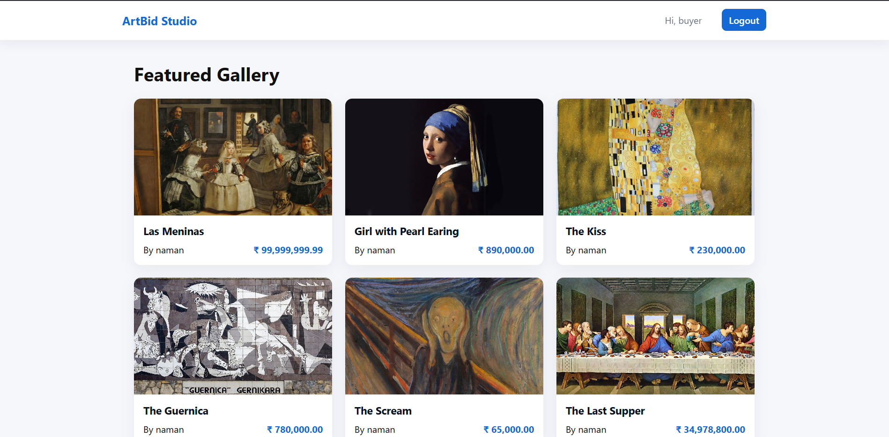
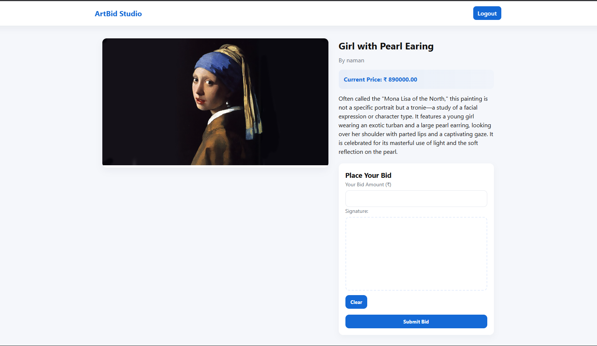
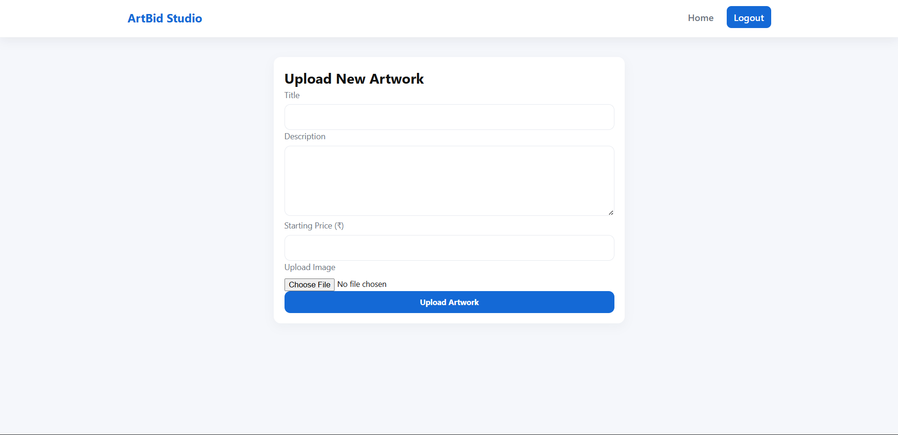

# 🎨 ArtBid Studio — Online Art Gallery & Auction System

ArtBid Studio is a full-stack web application that allows **artists** to upload artwork and **buyers** to place live bids using a built-in signature pad.  
The system updates bids in real-time using **AJAX + XML polling**, and includes secure authentication, artwork management, and dynamic price updates.

---

## 🚀 Features

### 👩‍🎨 For Artists
- Secure artist login
- Upload artwork with images
- Add title, description, and starting price
- Artwork auto-displays on the public gallery
- Image stored in `/assets/images/uploads/`

### 🧑‍💼 For Buyers
- Register & login securely
- View all available artworks
- Place bids higher than the current price
- Draw a **digital signature** using HTML5 Canvas
- Real-time updated price (XML + AJAX polling)

### 💻 System Features
- Modern, professional UI
- Fully responsive layout
- Secure password hashing using PHP `password_hash()`
- CSRF protection for login & registration
- PDO-based secure database connection
- Real-time bid updates without reloading

---

## 🛠️ Tech Stack

### **Frontend**
- HTML5  
- CSS3  
- JavaScript (ES6)  
- jQuery  
- AJAX  
- Canvas API (for signature)

### **Backend**
- PHP 8 (Core backend logic)  
- MySQL (Database)  
- PDO (Prepared Statements)  
- XML (for real-time polling)

### **Tools**
- XAMPP / WAMP  
- VS Code  
- GitHub  

---

## 📁 Folder Structure

artbid-studio/
│
├── public/
│   ├── index.php
│   ├── login.php
│   ├── register.php
│   ├── upload_art.php
│   ├── art.php
│   ├── place_bid.php
│   ├── get_current_bid.php
│   └── assets/
│       ├── css/style.css
│       ├── js/app.js
│       └── images/uploads/
│
├── includes/
│   ├── db.php
│   └── auth.php
│
├── sql/
│   ├── artgallery.sql
│
└── README.md

---

## 🗄️ Database Setup

### 1️⃣ Create database
Open phpMyAdmin → create:

artgallery

### 2️⃣ Import SQL files (in this order)

1. sql/artgallery.sql     (main tables)

---

## 🧪 How to Run The Project

### ✔ Step 1 — Start Apache & MySQL  
Open XAMPP → Start both **Apache** and **MySQL**

### ✔ Step 2 — Place project in htdocs  

C:/xampp/htdocs/artbid-studio/

### ✔ Step 3 — Open in browser  

[http://localhost/artbid-studio/public/](http://localhost/artbid-studio/public/)

### ✔ Step 4 — Register users
- Create an **artist** account
- Create a **buyer** account

### ✔ Step 5 — Upload & Bid
- Artist uploads artwork  
- Buyer opens artwork → places bid with signature  
- Price updates in real-time  

---

## 🖼️ Screenshots (Suggested)

---

## 🔐 Security Features
- Password hashing using `password_hash()`
- CSRF tokens for login/register
- Input sanitization
- PDO prepared statements
- Role-based access control (Artist / Buyer)

---

## 🔄 Real-Time Bidding Workflow

1. Buyer enters bid  
2. Signature captured → Base64  
3. AJAX → `place_bid.php`  
4. MySQL updates `current_price`  
5. `get_current_bid.php` returns **XML**  
6. JavaScript updates UI every 2 seconds  

---

## ⭐ Acknowledgments

- Guided by the **Internet & Web Programming** syllabus  
- Built using open web technologies  

---

### 🎉 **Thank you for checking out ArtBid Studio!**
If you like this project, consider giving the GitHub repo a ⭐ star.

---